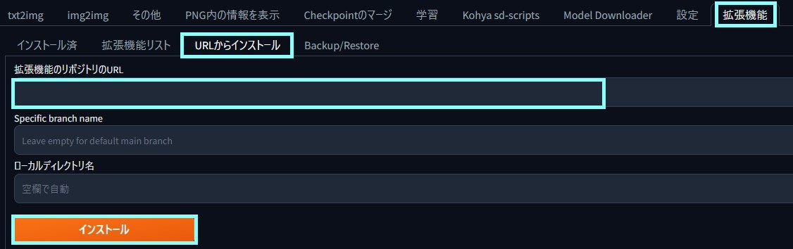
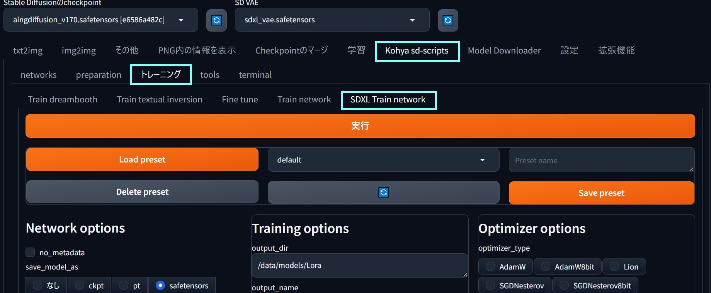
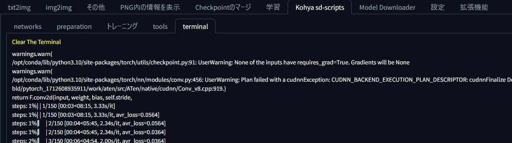

# a1111-kohya-sd-scripts - 日本語

## 概要

[kohya-sd-scripts-webui](https://github.com/ddPn08/kohya-sd-scripts-webui)を元に作成しました

[Stable Diffusion web UI](https://github.com/AUTOMATIC1111/stable-diffusion-webui)から[kohya-ss/sd-scripts](https://github.com/kohya-ss/sd-scripts)を実行する為の拡張機能です

## インストール

1. 「拡張機能のリポジトリのURL」に`https://github.com/masayay/a1111-kohya-sd-scripts`を入力し「インストール」
2. 「インストール済」→「適用してUIを再起動」

## SDXL Loraトレーニング

1. 「Kohya sd-scripts」→「トレーニング」→「SDXL Train Network」へ移動

2. 設定リストから「default」を選択し「Load preset」

3. 各種設定の見直し

- pretrained_model_name_or_path: 学習済モデルのパス
- dataset_config: データセットのコンフィグファイル
- output_dir: Loraファイルの出力先
- logging_dir: ログ出力先

オプションについては[wiki](./wiki/training)参照

4. 「実行」し「ターミナル」で確認

